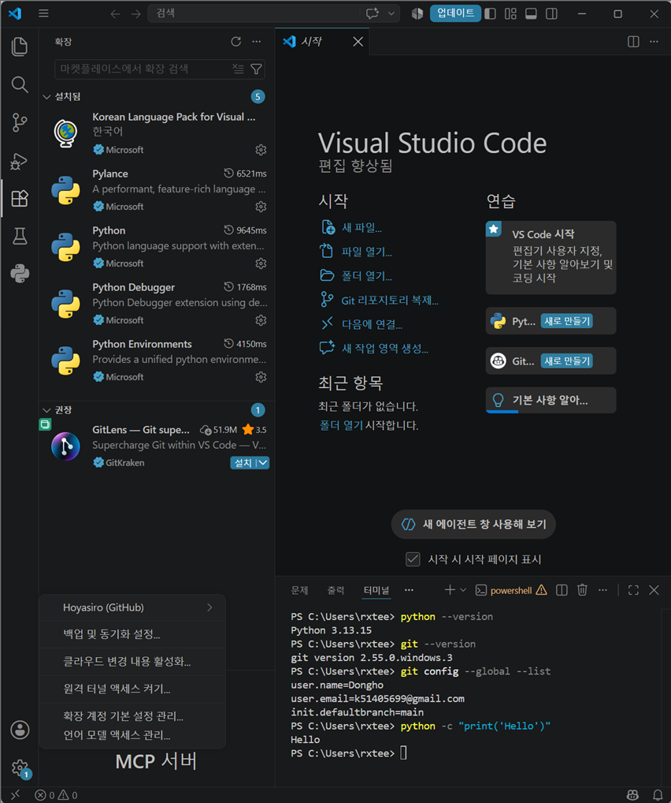
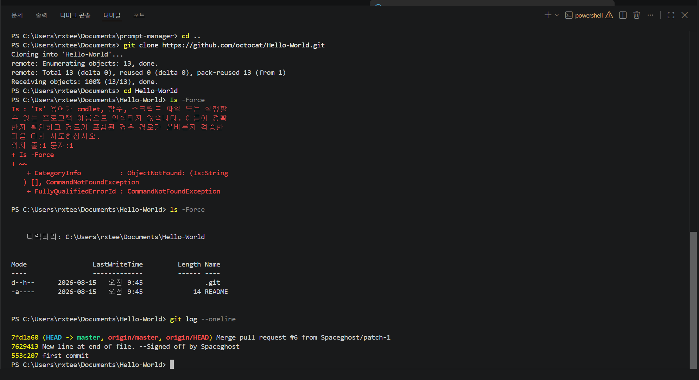
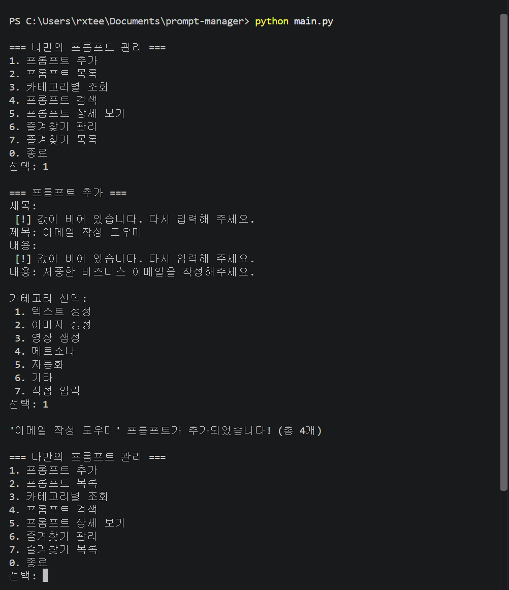
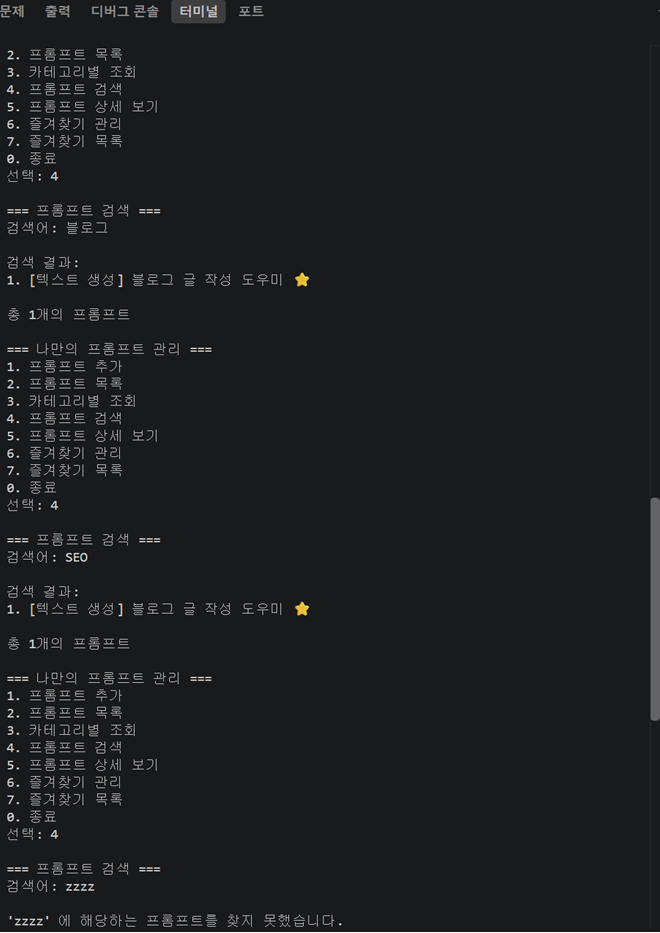
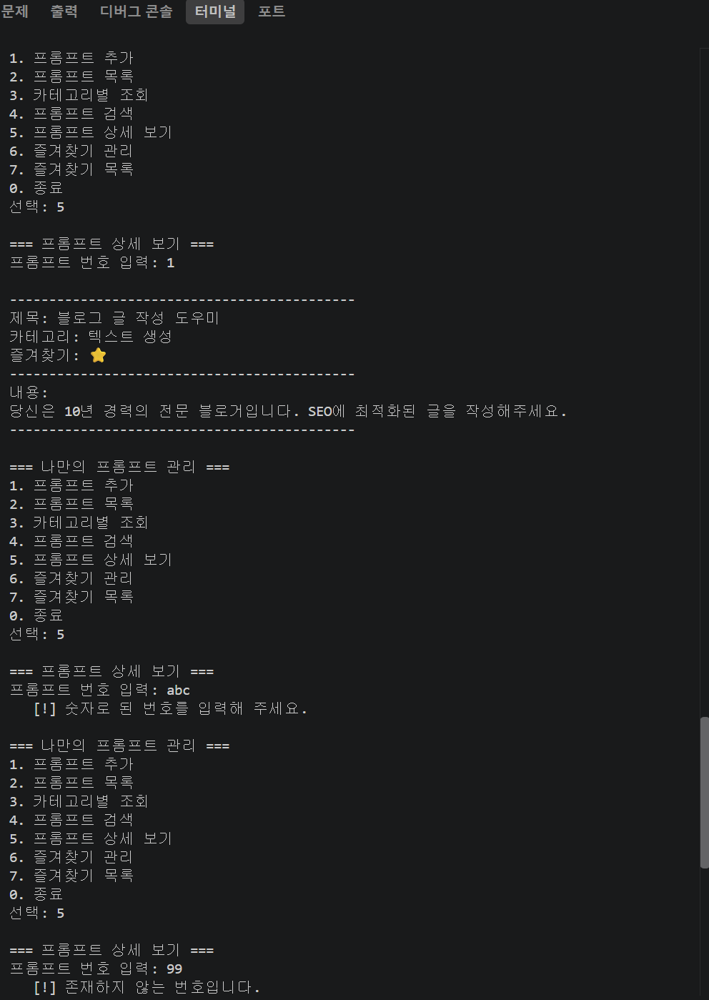
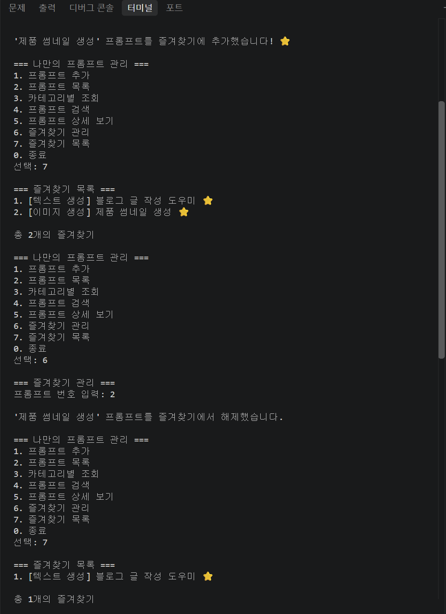
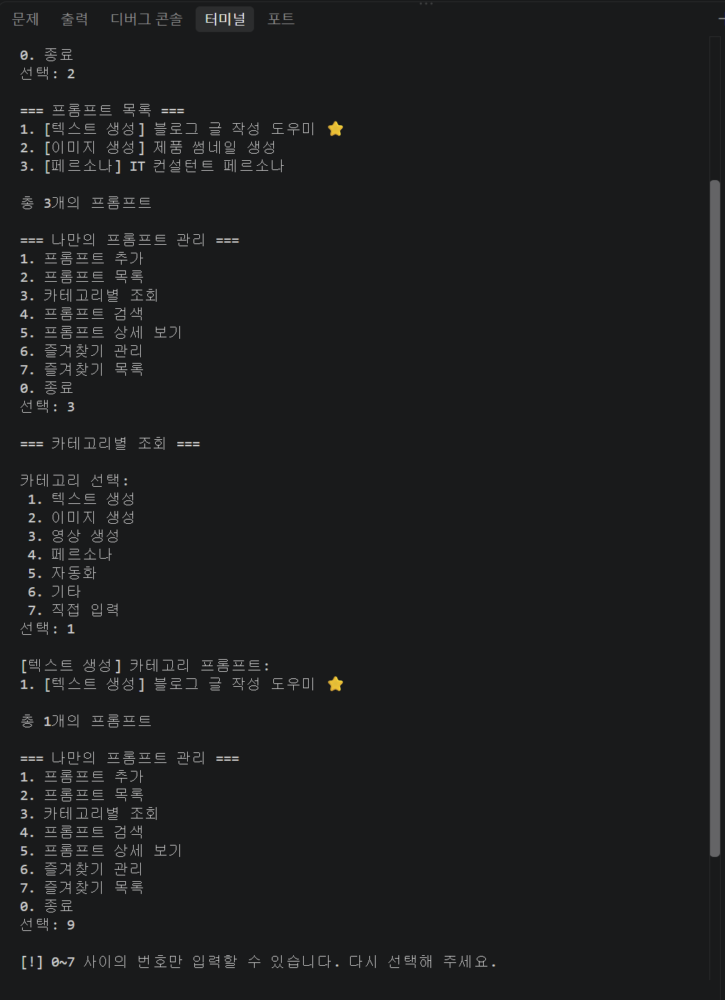
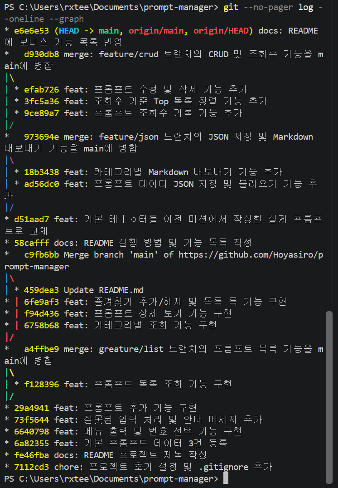
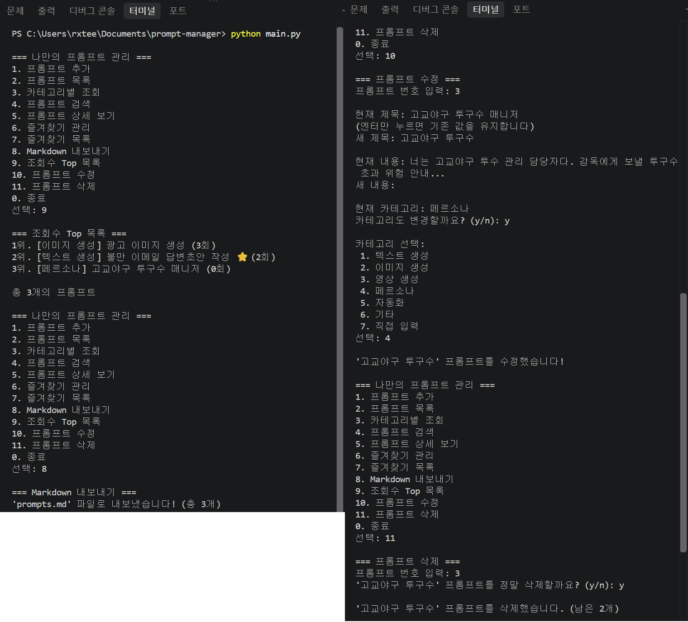

# 나만의 프롬프트 관리 (My Prompt Manager)

여기저기 흩어져 있던 AI 프롬프트를 한곳에 모아 두고,
**추가 / 목록 / 카테고리별 조회 / 검색 / 상세 보기 / 즐겨찾기** 로 관리하는 파이썬 콘솔 프로그램입니다.
외부 라이브러리 없이 파이썬 기본 문법(리스트, 딕셔너리, 조건문, 반복문, 함수)만으로 작성했습니다.

- 개발 언어: Python 3.10 이상
- 실행 환경: VSCode + 터미널
- 버전 관리: Git / GitHub

---

## 실행 방법

```bash
# 1) 저장소 내려받기
git clone https://github.com/Hoyasiro/prompt-manager.git
cd prompt-manager

# 2) 파이썬 버전 확인 (3.10 이상)
python --version      # macOS/Linux 에서는 python3 --version

# 3) 실행
python main.py        # macOS/Linux 에서는 python3 main.py
```

실행하면 메뉴가 출력됩니다. 번호를 입력해 기능을 선택하고, `0` 을 입력하면 종료됩니다.
별도의 설치(`pip install`)는 필요하지 않습니다.

```
=== 나만의 프롬프트 관리 ===
1. 프롬프트 추가
2. 프롬프트 목록
3. 카테고리별 조회
4. 프롬프트 검색
5. 프롬프트 상세 보기
6. 즐겨찾기 관리
7. 즐겨찾기 목록
0. 종료
선택:
```

---

## 기능 목록

| 번호 | 기능 | 설명 |
|:--:|---|---|
| 1 | 프롬프트 추가 | 제목·내용·카테고리를 입력해 새 프롬프트를 등록합니다. 입력값이 비어 있으면 다시 물어보며, 즐겨찾기 기본값은 `False` 입니다. |
| 2 | 프롬프트 목록 | 등록된 모든 프롬프트를 번호·카테고리·즐겨찾기(⭐)와 함께 출력합니다. |
| 3 | 카테고리별 조회 | 카테고리를 선택하면 해당 카테고리의 프롬프트만 출력합니다. 없으면 안내 메시지를 표시합니다. |
| 4 | 프롬프트 검색 | 키워드가 **제목 또는 내용** 에 포함된 프롬프트를 찾습니다. 대소문자를 구분하지 않습니다. |
| 5 | 프롬프트 상세 보기 | 번호를 입력하면 제목·카테고리·즐겨찾기 여부·내용 전체를 보여줍니다. 잘못된 번호는 안내 메시지를 출력합니다. |
| 6 | 즐겨찾기 관리 | 번호를 입력해 즐겨찾기를 추가/해제(토글)합니다. |
| 7 | 즐겨찾기 목록 | 즐겨찾기한 프롬프트만 모아서 출력합니다. |
| 8 | Markdown 내보내기 | 전체 프롬프트를 카테고리별로 정리한 `prompts.md` 파일을 생성합니다. |
| 9 | 조회수 Top 목록 | 상세 보기 횟수가 많은 순서로 정렬해 보여줍니다. |
| 10 | 프롬프트 수정 | 제목·내용·카테고리를 변경합니다. 엔터만 누르면 기존 값을 유지합니다. |
| 11 | 프롬프트 삭제 | 확인 후 프롬프트를 삭제합니다. |
| 0 | 종료 | 프로그램을 종료합니다. |

- 모든 기능은 수행 후 다시 메뉴로 돌아옵니다.
- 메뉴에서 `0~7` 이외의 값을 입력하면 안내 메시지를 출력하고 메뉴를 다시 보여줍니다.
- 목록·검색·카테고리 조회에 표시되는 번호는 **전체 목록 기준 번호** 이므로, 그 번호를 그대로 상세 보기(5번)와 즐겨찾기(6번)에 사용할 수 있습니다.
- 프롬프트 데이터는 `prompts.json` 파일에 자동 저장되어 **프로그램을 종료해도 유지**됩니다. (보너스 1)

---

## 등록된 프롬프트 카테고리

이전 미션에서 실제로 작성했던 프롬프트를 기본 데이터로 등록해 두었습니다.

| 카테고리 | 설명 | 기본 등록 예시 |
|---|---|---|
| 텍스트 생성 | 글·이메일·요약 등 텍스트 결과물을 만드는 프롬프트 | 블로그 글 작성 도우미 |
| 이미지 생성 | 이미지 생성 모델에 넣는 화면 구성·스타일 지시 프롬프트 | 제품 썸네일 생성 |
| 영상 생성 | 영상 클립·스크립트·콘티 제작용 프롬프트 | (직접 추가) |
| 페르소나 | 모델에게 특정 역할과 말투를 부여하는 프롬프트 | IT 컨설턴트 페르소나 |
| 자동화 | 노코드 자동화 흐름 안에서 반복 호출되는 프롬프트 | 뉴스 요약 자동화 프롬프트 |
| 기타 | 위 분류에 들어가지 않는 실험용 프롬프트 | (직접 추가) |

카테고리는 `main.py` 상단의 `CATEGORIES` 리스트에서 관리하며, 프롬프트 추가 시 목록에서 고르거나 직접 입력할 수 있습니다.

---

## 데이터 구조

```python
prompts = [
    {
        "title": "블로그 글 작성 도우미",   # 제목
        "content": "당신은 10년 경력의...",  # 내용(프롬프트 본문)
        "category": "텍스트 생성",          # 카테고리
        "favorite": True                    # 즐겨찾기 여부
    },
]
```

리스트(`prompts`) 안에 딕셔너리(프롬프트 1건)를 담는 구조입니다.

---
## 보너스 과제 구현

- **보너스 1** — JSON 영속화(`prompts.json` 자동 저장·불러오기), 카테고리별 Markdown 내보내기
- **보너스 2** — 프롬프트 수정/삭제, 상세 보기 조회수 기록, 조회수 기준 Top 목록

---
## 프로젝트 구조

```
.
├── main.py           # 프로그램 전체 (기능별 함수로 분리)
├── prompts.json      # 프롬프트 데이터 (자동 생성, .gitignore 대상)
├── prompts.md        # Markdown 내보내기 결과 (자동 생성, .gitignore 대상)
├── README.md
└── .gitignore
```

## 개발 환경 확인 결과

```
PS C:\Users\rxtee> python --version
Python 3.13.15

PS C:\Users\rxtee> git --version
git version 2.55.0.windows.3

PS C:\Users\rxtee> git config --global --list
user.name=Dongho
user.email=k51405699@gmail.com
init.defaultbranch=main

PS C:\Users\rxtee> python -c "print('Hello')"
Hello
```

공개 샘플 저장소 clone 확인:

```
PS C:\Users\rxtee\Documents> git clone https://github.com/octocat/Hello-World.git
Cloning into 'Hello-World'...
Receiving objects: 100% (13/13), done.

PS C:\Users\rxtee\Documents\Hello-World> git log --oneline
7fd1a60 Merge pull request #6 from Spaceghost/patch-1
7629413 New line at end of file. --Signed off by Spaceghost
553c207 first commit
```

---

## 커밋 및 브랜치 정책

### 커밋 단위 기준

**기능 하나 = 커밋 하나**를 원칙으로 했습니다. 화면에 보이는 동작이 하나 늘거나 바뀔 때마다 커밋하며, 여러 기능을 한 커밋에 묶지 않습니다.

메시지는 `<타입>: <무엇을 왜 바꿨는지>` 형식을 따릅니다.

| 타입 | 용도 | 예시 |
|---|---|---|
| `feat` | 새 기능 추가 | `feat: 키워드 검색 기능 구현` |
| `docs` | 문서 변경 | `docs: README 실행 방법 및 기능 목록 작성` |
| `chore` | 설정·부수 작업 | `chore: 프로젝트 초기 설정 및 .gitignore 추가` |
| `merge` | 브랜치 병합 | `merge: feature/list 브랜치를 main에 병합` |

`update`, `수정` 처럼 변경 의도를 알 수 없는 메시지는 사용하지 않았습니다.

### 브랜치 전략

`main`은 항상 **동작하는 상태**를 유지하고, 기능 개발은 `feature/<기능명>` 브랜치에서 진행한 뒤 병합합니다.

| 브랜치 | 용도 | 병합 결과 |
|---|---|---|
| `main` | 언제나 실행 가능한 기준 브랜치 | — |
| `feature/list` | 프롬프트 목록 조회 기능 | `a4ffbe9` |
| `feature/json` | JSON 영속화 · Markdown 내보내기 (보너스 1) | `973694e` |
| `feature/crud` | 수정·삭제 · 조회수 (보너스 2) | `d930db8` |

병합 시 `--no-ff` 옵션을 사용합니다. Fast-forward로 병합하면 브랜치가 존재했던 흔적이 사라져 `git log --graph` 에서 작업 단위를 구분할 수 없기 때문입니다.

```bash
git checkout -b feature/list
# ... 기능 구현 및 커밋 ...
git checkout main
git merge --no-ff feature/list -m "merge: feature/list 브랜치를 main에 병합"
git branch -d feature/list
```

### 실제 커밋 이력

```
* e6e6e53 docs: README에 보너스 기능 목록 반영
*   d930db8 merge: feature/crud 브랜치의 CRUD 및 조회수 기능을 main에 병합
|\
| * efab726 feat: 프롬프트 수정 및 삭제 기능 추가
| * 3fc5a36 feat: 조회수 기준 Top 목록 정렬 기능 추가
| * 9ce89a7 feat: 프롬프트 조회수 기록 기능 추가
|/
*   973694e merge: feature/json 브랜치의 JSON 저장 및 Markdown 내보내기 기능을 main에 병합
|\
| * 18b3438 feat: 카테고리별 Markdown 내보내기 기능 추가
| * ad56dc0 feat: 프롬프트 데이터 JSON 저장 및 불러오기 기능 추가
|/
* d51aad7 feat: 기본 데이터를 이전 미션에서 작성한 실제 프롬프트로 교체
* 58cafff docs: README 실행 방법 및 기능 목록 작성
*   c9fb6bb Merge branch 'main' of github.com/Hoyasiro/prompt-manager
|\
| * 459dea3 Update README.md
* | 6fe9af3 feat: 즐겨찾기 추가/해제 및 목록 기능 구현
* | f94d436 feat: 프롬프트 상세 보기 기능 구현
* | 6758b68 feat: 카테고리별 조회 기능 구현
|/
*   a4ffbe9 merge: feature/list 브랜치의 프롬프트 목록 기능을 main에 병합
|\
| * f128396 feat: 프롬프트 목록 조회 기능 구현
|/
* 29a4941 feat: 프롬프트 추가 기능 구현
* 73f5644 feat: 잘못된 입력 처리 및 안내 메시지 추가
* 6640798 feat: 메뉴 출력 및 번호 선택 기능 구현
* 6a82355 feat: 기본 프롬프트 데이터 3건 등록
* fe46fba docs: README 프로젝트 제목 작성
* 7112cd3 chore: 프로젝트 초기 설정 및 .gitignore 추가
```

---

## 자료구조 선택 근거

프롬프트 데이터는 **딕셔너리를 담은 리스트**(`list[dict]`) 구조입니다.

| 필드 | 타입 | 필수 | 설명 |
|---|---|:--:|---|
| `title` | str | 필수 | 프롬프트 제목. 목록·검색의 주 식별자 |
| `content` | str | 필수 | 프롬프트 본문. 검색 대상에 포함 |
| `category` | str | 필수 | 6개 기본 카테고리 중 하나 또는 직접 입력값 |
| `favorite` | bool | 필수 | 즐겨찾기 여부. 신규 등록 시 기본값 `False` |
| `views` | int | 선택 | 상세 보기 횟수. 보너스 2에서 추가된 필드 |

**리스트를 쓴 이유**

- 등록 순서가 곧 사용자에게 보이는 번호가 되어, `enumerate()` 결과를 그대로 화면 번호로 쓸 수 있습니다
- 목록·검색·카테고리 조회가 모두 전체 순회 기반이라 순차 접근이 자연스럽습니다
- **단점**: 번호로 찾을 때 `O(n)` 탐색이 필요합니다. 수백 건 규모까지는 체감 차이가 없어 우선순위를 두지 않았습니다

**딕셔너리를 쓴 이유**

- `prompt["title"]` 처럼 **필드 이름으로 접근**해 코드 가독성이 높습니다. 튜플이었다면 `prompt[0]` 이 무엇인지 매번 확인해야 합니다
- 필드 추가가 기존 코드에 영향을 주지 않습니다. 실제로 보너스 2에서 `views` 를 추가할 때 기존 함수를 고치지 않아도 됐습니다
- `json.dump()` / `json.load()` 와 1:1 대응해 영속화 변환 비용이 없습니다
- **단점**: 오타가 나도 실행 전까지 발견되지 않습니다. `prompt.get("views", 0)` 형태로 기본값을 지정해 완화했습니다

**클래스를 쓰지 않은 이유**: 미션이 기본 문법 범위를 요구했고, 데이터에 부여할 동작(메서드)이 없는 순수 자료 구조여서 딕셔너리로 충분했습니다.

---

## 입력 검증 및 예외 처리 규칙

| 상황 | 처리 |
|---|---|
| 메뉴에서 `0~11` 외 입력 | 안내 메시지 출력 후 메뉴 재출력 |
| 제목·내용 빈 입력 | 값이 입력될 때까지 반복 요청 (`input_required()`) |
| 번호 입력에 문자 입력 (`abc`) | `.isdigit()` 검사 후 안내 메시지, 기능 취소 |
| 번호가 범위 밖 (`0`, `99`) | `0 <= index < len(prompts)` 검사 후 안내 메시지 |
| 카테고리 선택 오류 | 기본값 `기타` 로 저장하고 사용자에게 고지 |
| JSON 파일 없음 | 기본 데이터로 시작 (`os.path.exists()` 검사) |
| JSON 파일 손상 | `try/except` 로 포착, 기본 데이터로 시작하고 원인 출력 |
| 구 버전 데이터에 `views` 누락 | 불러올 때 `0` 으로 자동 보정 |

### 중복 및 충돌 처리 정책

**동일 제목 프롬프트 등록**: 현재는 허용합니다. 같은 제목이라도 내용·카테고리가 다른 변형본을 함께 보관하는 경우가 실제로 많고, 각 항목은 제목이 아니라 **리스트 순번**으로 식별되므로 동작상 충돌이 발생하지 않습니다.

다만 실수로 인한 중복 등록은 사용자가 인지하기 어려우므로, 향후 다음 정책을 적용할 계획입니다.

1. 추가 시 동일 제목이 있으면 기존 항목을 보여주고 `덮어쓰기 / 새로 추가 / 취소` 를 확인
2. 기본 동작은 **새로 추가**(비파괴적 선택)
3. 삭제·수정처럼 되돌릴 수 없는 작업은 이미 `y/n` 확인 절차를 거치도록 구현되어 있음

**파일 동시 접근**: 단일 사용자 콘솔 프로그램을 전제로 하여 파일 락을 두지 않았습니다. 여러 프로세스가 동시에 실행되면 나중에 저장한 쪽이 이깁니다(last-write-wins). 저장 실패 시 `try/except` 로 오류를 알리되 프로그램은 종료되지 않습니다.

## 제출용 스크린샷

### 개발 환경
Python·Git 버전, 사용자 정보, VSCode 확장, GitHub 계정 연동 상태



### 공개 저장소 clone 확인
샘플 저장소를 clone하여 폴더 구조와 커밋 로그 확인



### 프롬프트 추가 (빈 입력 검증)
제목·내용이 비어 있으면 다시 입력을 요청



### 프롬프트 검색
제목·내용 검색 성공 / 결과 없을 때 안내



### 상세 보기
정상 조회 / 존재하지 않는 번호 / 숫자가 아닌 입력



### 즐겨찾기 관리
추가·해제 토글 및 즐겨찾기 목록



### 목록 및 카테고리별 조회
전체 목록, 카테고리 필터, 잘못된 메뉴 입력 처리



### 커밋 이력 그래프
커밋 20개, 브랜치 생성·병합 이력



### 보너스 기능
조회수 Top 목록, Markdown 내보내기, 수정·삭제

